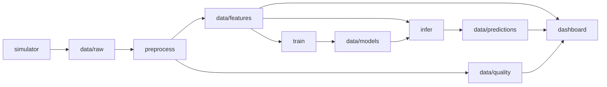
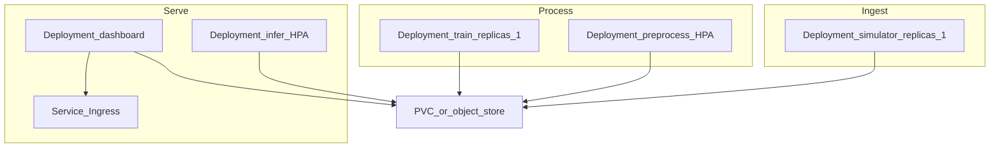

# Dockerizing DashBite & Scaling with Kubernetes

Guide for packaging each pipeline stage as a container and scaling those images independently on Kubernetes. This document is a **design/runbook guide** — the repo may still run as local Python processes without Docker installed.

Related: [Low-Level Design](./lld-dashbite-ml-pipeline.md)

---

## Why this pipeline containerizes cleanly

Each stage is already an independent process with a clear entry point and file-based handoffs:

| Stage | Entry point | Reads | Writes |
|-------|-------------|-------|--------|
| Simulator | `python -m pipeline.simulator` | — | `data/raw/` |
| Preprocess | `python -m pipeline.preprocess` | `data/raw/` | `data/features/`, `data/quality/` |
| Train | `python -m pipeline.train` | `data/features/` | `data/models/` |
| Infer | `python -m pipeline.infer` | `data/features/`, `data/models/` | `data/predictions/` |
| Dashboard | `streamlit run pipeline/dashboard/app.py` | features, predictions, quality | — |

Train and infer do **not** import each other. They only share checkpoint files under `data/models/`. That boundary is what lets you run (and later scale) them as separate containers.



**Recommended packaging:** one shared image (`dashbite:latest`), different `command` per service, one shared data volume mounted at a configurable `DATA_ROOT`.

---

## Part 1 — How to Dockerize

### 1. Container-friendly data root

Today paths default to `<project>/data`. For containers, support an env override:

- `DATA_ROOT=/app/data` (or `/data`)
- All stages and the dashboard resolve `raw/`, `features/`, `models/`, `predictions/`, `quality/` under that root
- Compose/K8s mount one volume there so every container sees the same pipeline state

### 2. Single Dockerfile (many commands)

Use one image for every stage:

```dockerfile
FROM python:3.12-slim
WORKDIR /app
COPY requirements.txt .
RUN pip install --no-cache-dir -r requirements.txt
COPY pipeline/ pipeline/
ENV PYTHONPATH=/app
ENV DATA_ROOT=/app/data
# Command overridden per service in Compose / Kubernetes
CMD ["python", "-m", "pipeline.simulator"]
```

Notes:

- Expose port `8501` only for the dashboard service
- `.dockerignore` should exclude `.venv/`, local `data/`, `.pytest_cache/`, and ideally keep the image free of host test artifacts
- No multi-stage build required for this teaching stack

### 3. Docker Compose — one service per stage

```yaml
# Conceptual shape — services share one named volume
services:
  simulator:
    image: dashbite:latest
    command: python -m pipeline.simulator
    environment: &pipeline_env
      DATA_ROOT: /app/data
      TRAIN_EVERY_N_EVENTS: "50"
      BATCH_SIZE: "20"
      POLL_INTERVAL_SECONDS: "15"
      CORRUPT_BATCH_RATE: "0.25"
    volumes:
      - dashbite-data:/app/data
    restart: unless-stopped

  preprocess:
    image: dashbite:latest
    command: python -m pipeline.preprocess
    environment: *pipeline_env
    volumes:
      - dashbite-data:/app/data

  train:
    image: dashbite:latest
    command: python -m pipeline.train
    environment: *pipeline_env
    volumes:
      - dashbite-data:/app/data

  infer:
    image: dashbite:latest
    command: python -m pipeline.infer
    environment: *pipeline_env
    volumes:
      - dashbite-data:/app/data

  dashboard:
    image: dashbite:latest
    command: >
      streamlit run pipeline/dashboard/app.py
      --server.address 0.0.0.0 --server.port 8501
    environment: *pipeline_env
    volumes:
      - dashbite-data:/app/data
    ports:
      - "8501:8501"

volumes:
  dashbite-data:
```

| Service | Scale intent (Compose) |
|---------|------------------------|
| `simulator` | Keep at **1** |
| `preprocess` | Keep at **1** for file-based demo |
| `train` | Keep at **1** (sole checkpoint writer) |
| `infer` | Can try `--scale infer=2` for demo; watch for duplicate scoring |
| `dashboard` | **1**; open http://localhost:8501 |

Typical local commands:

```bash
docker compose up --build -d
docker compose logs -f preprocess
docker compose down
```

### 4. Environment variables

| Variable | Default | Meaning |
|----------|---------|---------|
| `DATA_ROOT` | `<project>/data` | Shared pipeline data directory |
| `TRAIN_EVERY_N_EVENTS` | `2000` | Retrain after this many new labeled rows |
| `BATCH_SIZE` | `50` | Orders per simulator tick |
| `POLL_INTERVAL_SECONDS` | `15.0` | Sleep between polls/ticks |
| `CORRUPT_BATCH_RATE` | `0.25` | Fraction of batches with NaNs / bad types |
| `RANDOM_SEED` | `42` | Training seed |

### 5. Concurrency caveat (important)

Handoffs use CSV files and simple markers (e.g. preprocess `.done_*`, infer “already scored” filters). **Multiple writers on the same directories can race.**

For Compose demos:

- Run **simulator**, **preprocess**, and **train** at 1 replica
- Treat multi-replica **infer** as experimental until claim/shard logic exists

Host `pytest` remains the quality gate; containers are a packaging layer on top of the same modules.

---

## Part 2 — Kubernetes: scale each image effectively

Use the **same image**, different Deployments and commands. Shared storage is the critical design choice.



### Per-component scaling policy

| Image / command | K8s object | Replicas / HPA | Why |
|-----------------|------------|----------------|-----|
| **simulator** | Deployment | **Fixed 1** | Single producer avoids duplicate batches; scale *rate* via `BATCH_SIZE` / `POLL_INTERVAL_SECONDS`, not pods |
| **preprocess** | Deployment + HPA | **1 → N** on CPU or backlog | Scales with ingest volume; needs safe multi-writer pattern (below) |
| **train** | Deployment | **Fixed 1** | Sole writer of checkpoints; multiple trainers race on `train_state.json` |
| **infer** | Deployment + HPA | **1 → M** on CPU or unscored rows | Independent of train; scales with scoring load |
| **dashboard** | Deployment + Service | **1 → 2** | Mostly read-only; put a Service (and optional Ingress) in front |

### Storage options

1. **Local / demo (kind, minikube, single-node):** one PVC with **ReadWriteMany**, or `hostPath`, mounted at `DATA_ROOT` on every pod.
2. **Production-shaped:** keep the same containers, swap directory polling for object storage + queue (e.g. S3 + SQS/Kafka). Only the I/O adapter behind `raw_dir` / `features_dir` changes. Then HPA across nodes is safe.

### Making HPA safe with files (minimal teaching upgrade)

Before setting preprocess/infer HPA above 1 on a shared PVC:

- **Preprocess:** claim a raw file with atomic create of `.claim_<filename>` (or rename into `raw/in_progress/`). Only the claimer writes features + the quality log row.
- **Infer:** claim unscored `order_id`s via markers under `data/predictions/.claims/`, **or** shard with `hash(order_id) % N` using a pod ordinal / StatefulSet index.

**Train** stays at 1 replica. Protect it with a PodDisruptionBudget (`minAvailable: 1`) so it is not evicted mid-checkpoint.

### Example HPA signals

| Component | Scale on |
|-----------|----------|
| preprocess | CPU &gt; 70%, or custom metric `raw_files_pending` |
| infer | CPU &gt; 70%, or custom metric `unscored_feature_rows` |
| simulator / train | No HPA — tune env knobs only |
| dashboard | Optional light HPA; not the bottleneck |

### Suggested manifest layout

```text
k8s/
  namespace.yaml
  pvc.yaml
  configmap.yaml
  deployment-simulator.yaml
  deployment-preprocess.yaml
  deployment-train.yaml
  deployment-infer.yaml
  deployment-dashboard.yaml
  service-dashboard.yaml
  hpa-preprocess.yaml
  hpa-infer.yaml
  pdb-train.yaml
```

Every Deployment uses `image: dashbite:latest`, the same ConfigMap env, and the same PVC mount at `DATA_ROOT`.

Example shape for a scalable Deployment:

```yaml
apiVersion: apps/v1
kind: Deployment
metadata:
  name: dashbite-infer
spec:
  replicas: 1
  selector:
    matchLabels:
      app: dashbite-infer
  template:
    metadata:
      labels:
        app: dashbite-infer
    spec:
      containers:
        - name: infer
          image: dashbite:latest
          command: ["python", "-m", "pipeline.infer"]
          envFrom:
            - configMapRef:
                name: dashbite-config
          volumeMounts:
            - name: data
              mountPath: /app/data
      volumes:
        - name: data
          persistentVolumeClaim:
            claimName: dashbite-data
---
apiVersion: autoscaling/v2
kind: HorizontalPodAutoscaler
metadata:
  name: dashbite-infer
spec:
  scaleTargetRef:
    apiVersion: apps/v1
    kind: Deployment
    name: dashbite-infer
  minReplicas: 1
  maxReplicas: 8
  metrics:
    - type: Resource
      resource:
        name: cpu
        target:
          type: Utilization
          averageUtilization: 70
```

### What not to scale

- Do **not** run multiple **train** pods against one models directory
- Do **not** run multiple **simulator** pods without partitioning (you will duplicate events)
- Do **not** HPA the **dashboard** aggressively — it is not the throughput bottleneck

---

## Teaching narrative

```text
modular processes
  → one image, many commands
    → Docker Compose locally (shared volume)
      → Kubernetes Deployments
        → HPA on preprocess + infer
        → fixed singletons for simulator + train
```

That progression shows how the same DashBite stages move from a laptop demo to independently scalable services without rewriting the ML logic.

---

## Implementation checklist (when you build it)

1. Add `DATA_ROOT` support in `pipeline/paths.py`, config, and dashboard
2. Add `Dockerfile` + `.dockerignore`
3. Add `docker-compose.yml` (five services + shared volume)
4. Document compose commands in the root README
5. Later: add `k8s/` manifests and claim/shard helpers before HPA &gt; 1 on shared files
