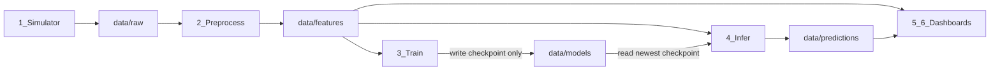

# Low-Level Design: DashBite ML Pipeline

## Overview

A deliberately simple, stage-by-stage teaching demo of DashBite (late-delivery risk). Modular Python packages coupled via CSV/checkpoint folders — no containers. Train and infer are independent; inference uses the newest checkpoint. After every stage, unit + regression + integration tests must pass before moving on.

## Teaching goal

Show **how to build a data/ML application one stage at a time** with **modular design**. Each stage is a small Python module/script with a clear file-based handoff. No Docker or containers — modular folders and independent processes are enough.

**Audience framing:** live DashBite orders flowing through the system. Implementation uses **batch CSV writes** under the hood — never call that out in the UI.

**Quality gate:** after finishing each stage, run **unit + regression + integration** tests. The new stage must work, and **all earlier stages must still pass** (nothing broken by the new code).

## Use case

**DashBite** predicts whether an order will be **late** (`was_late`: 0/1).

Raw order fields (keep short):
- `order_id`, `timestamp`, `distance_km`, `prep_minutes`, `order_value`, `was_late`

That is enough for every stage. No multi-event joins, no weather, no restaurant history.



**Independent train vs infer (important teaching point):**
- Training and inference are **separate modules / processes**. Neither imports or calls the other.
- The only coupling is the shared folder `data/models/` (checkpoints on disk).
- Train **only writes** new checkpoints; infer **only reads**.
- Inference always selects the **most recent available checkpoint** (e.g. by filename timestamp or `mtime`). If none exists yet, it skips until one appears — it does not wait on or trigger training.

**Stack (simple on purpose):** Python packages/scripts, CSV files between stages, scikit-learn (`LogisticRegression`), poll-loop inference, Streamlit (2 pages), `requirements.txt`, **pytest**. **No containers.**

**How stages run:** each stage is started on its own (e.g. `python -m pipeline.simulator`, `python -m pipeline.train`, …) in separate terminals, all sharing the same `data/` directory on disk.

---

## Testing plan (required after every stage)

### Goal

Teach that each new module is verified in isolation **and** that the growing pipeline still hangs together. Students do not move to the next stage until the full suite is green.

### Test layout (keep simple)

```
tests/
  unit/           # fast, no full pipeline
  regression/     # fixed fixtures / golden outputs
  integration/    # stage handoffs through temp data dirs
  fixtures/       # small CSVs, tiny checkpoints, expected outputs
```

Markers (optional but clear for teaching): `@pytest.mark.unit`, `@pytest.mark.regression`, `@pytest.mark.integration`.

**Default command after every stage:** `pytest` (runs the entire suite so old stages cannot silently break).

### What each kind of test means here

| Kind | Purpose | Rule of thumb |
|------|---------|----------------|
| **Unit** | One function/module behaves correctly | Pure logic; temp dirs OK; no need for full pipeline |
| **Regression** | Known input still produces known output | Small fixture in `tests/fixtures/`; assert against golden CSV/JSON |
| **Integration** | Handoff between stages still works | Wire 2+ stages on a temp `data/` tree; assert files appear with expected columns |

Keep each test **tiny** — one clear assertion story, matching the “1–2 features per stage” rule.

### Gate after each stage

After implementing stage *N*:

1. Add **unit** tests for stage *N*’s new functions
2. Add **regression** fixture(s) for stage *N*’s stable outputs
3. Add/extend **integration** coverage for stage *N*’s handoff (and any path that touches older stages)
4. Run **`pytest`** — must pass **all** tests from stages `0…N`
5. Only then start stage *N+1*

### Tests expected per stage (still 1–2 checks each)

**Stage 0 — Skeleton**
- Unit: config loads `TRAIN_EVERY_N_EVENTS`; required data dirs resolve
- Regression: default config values match a frozen expected dict
- Integration: creating the project paths works in a temp workspace

**Stage 1 — Simulator**
- Unit: one batch has required columns and valid ranges
- Regression: seeded generator matches a golden small CSV
- Integration: running one tick writes a file under `data/raw/`

**Stage 2 — Preprocess**
- Unit: drop-invalid + feature column(s) (`hour` / `is_peak`)
- Regression: fixed raw fixture → golden features CSV
- Integration: raw landing → features output; earlier simulator regression still green

**Stage 3 — Train**
- Unit: retrain triggers only when new labeled count ≥ N; checkpoint filename written
- Regression: fixed features fixture → stable metrics JSON shape (and/or deterministic seed)
- Integration: features → new checkpoint in `data/models/`; train does not import infer

**Stage 4 — Infer**
- Unit: “newest checkpoint” selection; skip cleanly when no checkpoint
- Regression: fixed features + checkpoint → golden predictions (ids/scores within tolerance)
- Integration: features + checkpoint → `data/predictions/`; infer does not import train; older stages still pass

**Stage 5 — ML dashboard**
- Unit: helper(s) that compute sample volume / score summary from dataframes
- Regression: fixture preds/features → expected chart/KPI numbers
- Integration: helpers read real-shaped files from a temp data tree produced like prior stages

**Stage 6 — Business dashboard**
- Unit: late rate + at-risk value helpers
- Regression: fixture → expected KPI numbers
- Integration: reads features/predictions handoff; full suite including stages 0–5 still green

**Stage 7 — Runbook**
- Document the gate in the README (`pytest` after every stage)
- Ensure one command runs unit + regression + integration together

### Teaching note

Regression tests are how we prove **old stages are not broken**. Integration tests are how we prove **the new stage plugs into the pipeline**. Unit tests keep each lesson’s logic easy to debug when something fails.

---

## Stage 0 — Skeleton

**Teach:** project layout and shared config.

**1–2 features:**
1. Folders: `data/raw`, `data/features`, `data/models`, `data/predictions` + one package/module per stage
2. Shared config: `TRAIN_EVERY_N_EVENTS` (default 2000) and batch size

**Also:** create `tests/unit|regression|integration|fixtures` and wire pytest.

Deliverable: importable package layout; config readable by later stages; stage-0 test gate green.

---

## Stage 1 — Intake (batch under the hood)

**Teach:** producing data on a schedule; writing to a landing zone.

**1–2 features:**
1. Every few seconds, write a **batch CSV** of new synthetic orders to `data/raw/`
2. Log line like “new orders arrived” (live feel) — no batch jargon in messages

Deliverable: `data/raw/` fills while the simulator runs; stage 0–1 suite green.

---

## Stage 2 — Preprocessing

**Teach:** clean raw data and create a feature table for ML.

**1–2 features:**
1. Read new raw CSVs → drop rows with missing/invalid values
2. Add **one or two** columns only, e.g. `hour` from timestamp and/or `is_peak` (lunch/dinner window)

Write append/new files to `data/features/` (include `was_late` for training).

Deliverable: feature CSVs exist; stage 0–2 suite green.

---

## Stage 3 — Training (write path only)

**Teach:** models retrain when enough new labeled data arrives; training owns checkpoints.

**1–2 features:**
1. Count new labeled feature rows since last train; if ≥ `TRAIN_EVERY_N_EVENTS`, train
2. Fit a **tiny** model (e.g. `LogisticRegression` on `distance_km` + `prep_minutes`) and **write a new checkpoint** under `data/models/` (e.g. `checkpoint_YYYYMMDD_HHMMSS.joblib` + matching `metrics_….json`)

**Does not:** call inference, notify inference, or block on scoring.

Deliverable: first checkpoint after N labeled rows; train runs alone; stage 0–3 suite green.

---

## Stage 4 — Inference (read path only)

**Teach:** apply the newest saved checkpoint to new data; inference never depends on the train process being alive.

**1–2 features:**
1. On each poll: resolve **most recent available checkpoint** in `data/models/`; reload if newer
2. Score new feature rows; write `order_id`, `late_probability`, `predicted_late`, `checkpoint_id` to `data/predictions/`

**Does not:** trigger training or require train to be running. If no checkpoint exists, log once and wait.

Deliverable: predictions grow when a checkpoint exists; stage 0–4 suite green.

---

## Stage 5 — ML monitoring dashboard

**Teach:** watch whether the late-prediction system is healthy (claim-first charts).

**Features (charts/widgets):**
1. **Time-series volume** — orders over a recent window (active title; human-readable time axis)
2. **Score bands** — `late_probability` histogram with labels like `0.0–0.1` (not Interval objects); cue the 0.5 decision region
3. **Ranked field failures** — one horizontal bar chart; no duplicate table
4. **Few KPIs** (~3): samples, drop rate, mean score — not a metrics wall

Deliverable: sparse Streamlit Model Pulse page; stage 0–5 suite green (test helpers, not the browser UI).

---

## Stage 6 — Business dashboard

**Teach:** same pipeline, different audience — dollars at risk.

**Features:**
1. **At-risk order value** as the lead claim (active title)
2. **Late rate** beside it
3. Recent predictions table as **drill-down only** (not the main visual)

Deliverable: Ops Control page beside Model Pulse; stage 0–6 suite green.

---

## Stage 7 — Runbook

**Teach:** how to run the modular pipeline locally as separate processes, and how testing gates progress.

**1–2 features:**
1. README: install deps; run each stage in its own terminal; **run `pytest` after every stage**
2. Confirm the full suite (unit + regression + integration) is the single exit criterion before the next lesson

No Docker, Compose, Kafka, Spark, MLflow, or drift libraries.

---

## Classroom build order

For each stage below: implement → add its unit/regression/integration tests → run full `pytest` → only then continue.

1. Stage 0 — skeleton + test harness
2. Stage 1 — simulator
3. Stage 2 — preprocess
4. Stage 3 — train
5. Stage 4 — infer
6. Stage 5 — ML dashboard
7. Stage 6 — business dashboard
8. Stage 7 — README / runbook

**Rule of thumb for every PR/lesson:** if a stage needs a third feature, cut it. Same for tests: keep them few, clear, and mandatory.
